# Self-Hosted GitHub Actions Runners for Google Cloud

[](#readme)
[](#readme)
[](#readme)
[](#readme)
[](#readme)
[](https://github.com/Cyclenerd/google-cloud-github-runner/actions/workflows/ci.yml)
[](https://github.com/Cyclenerd/google-cloud-github-runner/blob/master/LICENSE)


This application is **exclusively built for Google Cloud Platform (GCP)**, leveraging native services like **Google Compute Engine (GCE) Instance Templates** to manage **ephemeral** just-in-time self-hosted GitHub Actions Runners. Unlike generic solutions that merely "support" GCP, this project offers a deep, cloud-native integration designed specifically for GCP.

For the developer, it functions as a **drop-in replacement**: just add `gcp-` to your GitHub Actions workflow YAML file (e.g., replace `runs-on: ubuntu-latest` with `runs-on: gcp-ubuntu-latest`).

The architecture prioritizes **simplicity and auditability**, avoiding complex abstractions. All services are configured **regionally**, giving you full control over data sovereignty. This ensures that strictly regional requirements—such as keeping all infrastructure and data within Germany—are easily met.

## ✨ Features

*   **Native Hardware Support**: Easily switch between **x86/64** (Intel, AMD) and **ARM** (Ampere Altra, Google Axion) architectures.
*   **Flexible Instance Sizes**: Choose the exact CPU and RAM needed for your workload using different GCE machine types.
*   **Workflows run in VMs, not Containers**: Better isolation and native support for tools that struggle in containerized environments (like Docker-in-Docker or system-level changes).
*   **No Kubernetes Overhead**: No cluster to manage, no complex operator configuration. Just Terraform and Cloud Run.
*   **Ephemeral Runners**: Automatically creates and destroys runners for each job.
*   **Org & Repo Level**: Supports both Organization and Repository level runners.
*   **Automatic Setup**: Easy web-based setup to create and configure the GitHub App.
*   **Secure Configuration**: Automatically stores credentials in Google Secret Manager.
*   **Cost Effective**: Runners are only active when jobs are queued.

## 📺 Video Tutorial

[](https://www.youtube.com/watch?v=TBCL2Z7ryzA)

Click the image to watch the 3-minute video tutorial.

## 🚀 Quick Start (10 Minutes)

The fastest way to get started is using **Google Cloud Shell**.

1.  **Open in Cloud Shell**:

    [](https://shell.cloud.google.com/cloudshell/open?shellonly=true&ephemeral=false&cloudshell_git_repo=https://github.com/Cyclenerd/google-cloud-github-runner&cloudshell_git_branch=master&cloudshell_tutorial=CLOUD_SHELL_TUTORIAL.md)
2.  **Trust the Repo**: Click "Trust repo" when prompted to enable the tutorial features.
3.  **Follow the Tutorial**: A step-by-step guide will open directly in your terminal.

## 📋 Prerequisites

All requirements are pre-installed in [Google Cloud Shell](https://shell.cloud.google.com/), making it the recommended environment for deployment.

Alternatively, you can install the tools locally on your machine.

> Note: If you don't want to install the Terraform and Google Cloud CLI locally yourself, you can also use a [Dev Container](https://containers.dev/).
> Try it out with the `Dev Containers: Reopen in Container` command in VS Code.

*   **Google Cloud Project**: A GCP project with billing enabled. The **Owner role** is the easiest option for this tutorial. If the Owner role is not possible, see [gcp/README.md](gcp/README.md) for the specific roles required.
*   **gcloud CLI**: [Download and install](https://docs.cloud.google.com/sdk/docs/install-sdk), then authenticate with your GCP account.
*   **Terraform**: [Download and install](https://developer.hashicorp.com/terraform/downloads), than use for easy Google Cloud services deployment.
*   **Python 3.14+**: Only needed for local development and changes to the code.

## ⚠️ Cost Control and Predictability

> [!WARNING]
> **This project will incur Google Cloud costs.** This application creates and manages Google Compute Engine instances, which generate billable charges. Key cost considerations:
> - **More instances = higher costs**: Each workflow job creates a new instance
> - **Larger instances = higher costs**: More CPU cores and RAM increase hourly rates
> - **Malfunctioning workflows**: A GitHub workflow pipeline that doesn't function properly may run longer than intended, accumulating unexpected costs
> - **Failed termination**: Instances may not be terminated and deleted correctly due to errors or misconfigurations, resulting in ongoing charges
> - **Billing alerts recommended**: Set up [Google Cloud billing alerts and budgets](https://cloud.google.com/billing/docs/how-to/budgets) to monitor and control spending
> 
> **Use at your own risk.** Always monitor your Google Cloud billing dashboard and implement cost controls.

Despite these cost considerations, self-hosting on Google Cloud offers significant advantages:

* **Potentially Lower Costs for High Usage:** For organizations with consistently high CI/CD usage, self-hosting on Google Cloud can be significantly more cost-effective than paying for GitHub Actions minutes, especially for larger jobs or parallel execution.
* **No Usage Limits (Within Google Compute Engine (GCE) Quota):** You're not restricted by GitHub Actions usage limits. This is beneficial for large builds, extensive testing, or frequent deployments.

The following table provides a comparison of pricing between GitHub-managed Actions runners and Google Cloud with self-hosted runners (information provided without guarantee):

| Runner | [GitHub](https://docs.github.com/en/billing/managing-billing-for-your-products/managing-billing-for-github-actions/about-billing-for-github-actions) | [Google Cloud](https://gcloud-compute.com/instances.html) | Cost Saving | Cost Saving (%) |
|-----------------|--------------|----------------|----------------|---------|
| 2 Core (Intel)  | $0.36 USD/hr | $0.067 USD/hr  | $0.293 USD/hr  | 81.39 % |
| 4 Core (Intel)  | $0.72 USD/hr | $0.134 USD/hr  | $0.586 USD/hr  | 81.39 % |
| 8 Core (Intel)  | $1.32 USD/hr | $0.268 USD/hr  | $1.052 USD/hr  | 79.70 % |
| 16 Core (Intel) | $2.52 USD/hr | $0.5361 USD/hr | $1.9839 USD/hr | 78.73 % |
| 2 Core (Arm)    | $0.30 USD/hr | $0.0898 USD/hr | $0.2102 USD/hr | 70.07 % |
| 4 Core (Arm)    | $0.48 USD/hr | $0.1796 USD/hr | $0.3004 USD/hr | 62.58 % |
| 8 Core (Arm)    | $0.84 USD/hr | $0.3592 USD/hr | $0.4808 USD/hr | 57.24 % |
| 16 Core (Arm)   | $1.56 USD/hr | $0.7184 USD/hr | $0.8416 USD/hr | 53.95 % |

GitHub prices are based on January 1, 2026.
Google Cloud prices are based on the `us-central1` (Iowa, USA) region using E2 or C2A machine types without disk space.

Further savings are possible through Committed Use Discounts (CUD) or Spot VMs.
For details on default machine types, see [`gcp/README.md`](gcp/README.md).

You can estimate costs using the [Google Cloud Pricing Calculator](https://cloud.google.com/products/calculator) or [gcloud-compute.com](https://gcloud-compute.com/). The minimum monthly cost for the deployed Cloud Run service is approximately $10 USD.

## 🛠️ Deployment to Google Cloud

Deploy the entire stack using Terraform:

```bash
git clone "https://github.com/Cyclenerd/google-cloud-github-runner.git"
cd google-cloud-github-runner/gcp
export GOOGLE_CLOUD_PROJECT=your-project-id
terraform init
terraform apply
```

**What this does:**
*   **Provisions Identity:** Creates a Service Account with least-privilege permissions (Compute Admin, Secret Manager Admin, Cloud Run Admin).
*   **Provisions Network:** Creates a VPC and Subnet with Cloud NAT for the runners.
*   **Custom Images:** Creates two custom Ubuntu images for the runners (one for Intel and one for ARM).
*   **Instance Templates:** Creates different Google Compute Engine Instance templates for the runners.
*   **Container Image:** Creates the Container image for the runner manager and stores it in Google Artifact Registry.
*   **Deploys Service:** Launches the runner manager on Cloud Run.
*   **Outputs URL:** Displays the `service_url` required for the setup below.

For detailed deployment instructions and configuration options, see [gcp/README.md](gcp/README.md).

## ⚙️ Configuration & Setup

Complete the setup via the provided web interface:

1.  **Access Setup:** Navigate to `service_url` (from Terraform output).
    
    **Authentication Required:** All `/setup` routes are protected with HTTP Basic Authentication:
    - **Username:** `cloud`
    - **Password:** Your Google Cloud Project ID (value of `GOOGLE_CLOUD_PROJECT`)
2.  **Create & Install:** Click **Setup GitHub App**, then install it on your target Organization or Repository.
3.  **Auto-Configuration:** The system handles the rest automatically:
    *   **Secure Storage:** Saves the Private Key to Secret Manager.
    *   **Service Update:** Configures Cloud Run with the new App ID and Installation ID.
    *   *(Local Dev)* Appends credentials to your `.env` file.

4.  **Update Workflows**:
    Configure your GitHub Actions CI/CD to use the runners. The `runs-on` key **must match** the name of the GCE Instance Template (e.g., `gcp-ubuntu-latest` or `gcp-ubuntu-24-04-8core-arm`).

    ```yaml
    jobs:
      test:
        runs-on: gcp-ubuntu-latest  # Must match GCE Template Name
        steps:
          - run: echo "Hello from Google Cloud!"
    ```

## 🏗️ Architecture

```mermaid
graph TD
    user((🧑‍💻 User))

    subgraph GitHub
        gh_actions[🐙 GitHub Actions]
        gh_api[📡 GitHub API]
    end

    subgraph GCP[Google Cloud Platform]
        subgraph CloudRun[Cloud Run Service]
            flask[🚀 Python Flask App]
        end

        subgraph Secrets[Secret Manager]
            s1[🆔 GitHub App ID]
            s2[🔢 GitHub Installation ID]
            s3[🔑 GitHub Private Key]
            s4[🔐 GitHub Webhook Secret]
        end

        subgraph GCE[Google Compute Engine]
            vm[🖥️ GitHub Actions Runner Instance]
        end
    end

    %% Flows
    user -->|Setup & Config| flask

    gh_actions -->|1. Webhook: Job Queued| flask

    %% Access Control: Only Cloud Run can Read/Write Secrets
    flask <-->|Read & Write| Secrets

    flask -->|2. Get Runner Token| gh_api
    flask -->|3. Create Runner Instance| vm

    vm -->|4. Register & Run Job| gh_actions

    gh_actions -->|5. Webhook: Job Completed| flask
    flask -->|6. Delete Runner Instance| vm

    class CloudRun,Secrets,GCE gcp;
    class gh_actions,gh_api gh;
    class user user;
```



1.  **Webhook: Job Queued**: GitHub sends `workflow_job.queued` to the webhook.
2.  **Get Runner Token**: App authenticates via stored Private Key to request a registration token.
3.  **Create Runner Instance (VM)**: App calls Google Compute Engine API to spawn a templated instance.
4.  **Register & Run Job**: Instance starts and registers with GitHub and runs the job.
5.  **Webhook: Job Completed**: Instance deregisters with GitHub and is deleted.
6.  **Delete Runner Instance (VM)**: App deletes the GCE instance upon `workflow_job.completed`.

## 🔐 Environment Variables

| Variable                  | Description                    | Required                                   |
|---------------------------|--------------------------------|--------------------------------------------|
| `FLASK_SECRET_KEY`        | Session encryption             | No (generate with `secrets.token_hex(32)`) |
| `GITHUB_APP_ID`           | GitHub App ID                  | Yes                                        |
| `GITHUB_INSTALLATION_ID`  | App Installation ID            | Yes                                        |
| `GITHUB_PRIVATE_KEY_PATH` | Path to App Private Key file   | Yes*                                       |
| `GITHUB_PRIVATE_KEY`      | App Private Key content        | Yes*                                       |
| `GITHUB_WEBHOOK_SECRET`   | Webhook signature secret       | Yes                                        |
| `GOOGLE_CLOUD_PROJECT`    | Google Cloud Project ID        | Yes                                        |
| `GOOGLE_CLOUD_ZONE`       | Default GCP zone for runners   | No (default: `us-central1-a`)              |
| `PORT`                    | Web server port                | No (default: `8080`)                       |
| `SETUP_USERNAME`          | Setup authentication username  | No (default: `cloud`)                      |
| `SETUP_PASSWORD`          | Setup authentication password  | No (default: `GOOGLE_CLOUD_PROJECT`)       |

*\*One of `GITHUB_PRIVATE_KEY` or `GITHUB_PRIVATE_KEY_PATH` must be set.*

## 📡 API Endpoints

*   `GET /setup/` - Setup interface (requires HTTP Basic Auth: username `cloud`, password is your Project ID)
*   `GET /setup/callback` - OAuth callback handler (requires HTTP Basic Auth)
*   `GET /setup/complete` - Post-installation handler (requires HTTP Basic Auth)
*   `POST /setup/trigger-restart` - Restart application (requires HTTP Basic Auth)
*   `POST /webhook` - Main GitHub webhook receiver (requires valid GitHub webhook signature)

## 💻 Local Development

To run the application locally for development or testing:

1.  **Clone the repository**:
    ```bash
    git clone "https://github.com/Cyclenerd/google-cloud-github-runner.git"
    cd google-cloud-github-runner
    ```

2.  **Create Virtual Environment**:
    ```bash
    python3 -m venv .venv
    source .venv/bin/activate
    ```

3.  **Install dependencies**:
    ```bash
    pip install -r requirements.txt
    pip install -r requirements-dev.txt
    ```

4.  **Set Environment Variables**:
    You need at least your GCP Project ID.
    ```bash
    export GOOGLE_CLOUD_PROJECT=your-project-id
    ```

5. **Run tests**
    ```bash
    # Run all tests
    pytest
   ```

6.  **Run the application**:
    ```bash
    python run.py
    ```
    The app will start at `http://localhost:8080`.


7.  **Expose to Internet (Optional)**:
    To receive webhooks from GitHub locally, use a tool like [Cloudflare Tunnel](https://developers.cloudflare.com/cloudflare-one/networks/connectors/cloudflare-tunnel/):
    ```bash
    cloudflared tunnel run --token [TOKEN]
    ```

## 📄 License

This project is licensed under the Apache License 2.0 - see the [LICENSE](LICENSE) file for details.

### Favicon

The favicon was generated using the following graphics from Twitter Twemoji:

*   **Graphics Title:** 1f431.svg
*   **Graphics Author:** Copyright 2020 Twitter, Inc and other contributors ([https://github.com/twitter/twemoji](https://github.com/twitter/twemoji))
*   **Graphics Source:** [https://github.com/twitter/twemoji/blob/master/assets/svg/1f431.svg](https://github.com/twitter/twemoji/blob/master/assets/svg/1f431.svg)
*   **Graphics License:** CC-BY 4.0 ([https://creativecommons.org/licenses/by/4.0/](https://creativecommons.org/licenses/by/4.0/))

## ⚖️ Disclaimer

This project is an independent Open Source initiative and is not affiliated with, endorsed by, or associated with GitHub or Google Cloud. All trademarks and registered trademarks are the property of their respective owners.
