# Google Cloud Set-Up

This directory contains the Terraform Infrastructure as Code (IaC) configuration and instructions to automatically create the Google Cloud Platform (GCP) infrastructure for the GitHub Actions Runners.

## Project

A separate Google Cloud project is recommended for the GitHub Actions Runners.

Create a Google Cloud project with a attached billing account.

### IAM Roles

The **Owner role** (`roles/owner`) is the easiest option for deploying this project. If the Owner role is not possible (e.g., in enterprise environments with restricted permissions), the following specific roles must be assigned to your Google account on project level:

| Role ID | Role Name | Purpose |
|---------|-----------|---------|
| `roles/artifactregistry.admin` | Artifact Registry Administrator | Manage container images in Artifact Registry |
| `roles/cloudbuild.builds.editor` | Cloud Build Editor | Trigger and manage Cloud Build jobs |
| `roles/compute.admin` | Compute Admin | Manage Compute Engine resources (VMs, templates, images) |
| `roles/iam.roleViewer` | Role Viewer | Provides read access to all custom roles in the project. |
| `roles/iam.serviceAccountAdmin` | Service Account Admin | Create and manage service accounts. |
| `roles/iam.serviceAccountUser` | Service Account User | Run operations as the service account. |
| `roles/monitoring.admin` | Monitoring Admin | All monitoring permissions. |
| `roles/orgpolicy.policyViewer` | Organization Policy Viewer | View organization policies |
| `roles/resourcemanager.projectIamAdmin` | Project IAM Admin | Access and administer a project IAM policies. |
| `roles/run.admin` | Cloud Run Admin | Deploy and manage Cloud Run services |
| `roles/secretmanager.admin` | Secret Manager Admin | Create and manage secrets |
| `roles/serviceusage.serviceUsageAdmin` | Service Usage Admin | Enable and disable Google Cloud APIs |
| `roles/storage.admin` | Storage Admin | Manage Cloud Storage buckets |

> **Tip:** Use the [`assign-iam-roles.sh`](../tools/assign-iam-roles.sh) script in the `/tools` folder to automatically assign these roles to a user:
> ```bash
> ./tools/assign-iam-roles.sh PROJECT_ID user@example.com
> ```

### 1. Login

Authenticate with Google Cloud and set the quota project:

```bash
gcloud auth login --no-launch-browser
gcloud auth application-default login --no-launch-browser
```

Set the quota project and project where the resources will be created:

```bash
gcloud projects list
export GOOGLE_CLOUD_PROJECT="your-project-id"
gcloud config set project "$GOOGLE_CLOUD_PROJECT"
gcloud auth application-default set-quota-project "$GOOGLE_CLOUD_PROJECT"
```

### 2. Organization Policy

Make sure that the organization policy
- "Allowed ingress settings (Cloud Run)" `run.allowedIngress` is configured and set to `all`, and
- "Domain restricted sharing" `iam.allowedPolicyMemberDomains` is configured and set to `allowAll`.

```yaml
run.allowedIngress
spec:
  rules:
  - values:
      allowedValues:
      - all

iam.allowedPolicyMemberDomains
spec:
  rules:
  - allowAll: true
```

> That is the default setting.
> However, in some Google Cloud organizations, mainly those of large companies, these values may have been changed.

```bash
gcloud services enable "orgpolicy.googleapis.com" --project="$GOOGLE_CLOUD_PROJECT"
gcloud org-policies describe "run.allowedIngress" --effective --project="$GOOGLE_CLOUD_PROJECT"
gcloud org-policies describe "iam.allowedPolicyMemberDomains" --effective --project="$GOOGLE_CLOUD_PROJECT"
```

If you are using the [Fabric FAST Project Factory](https://github.com/GoogleCloudPlatform/cloud-foundation-fabric), add the following to your `your-project-id.yaml`:

```yaml
org_policies:
  run.allowedIngress:
    rules:
      - allow:
          values:
            - all
  iam.allowedPolicyMemberDomains:
    rules:
      - allow_all: true
```

See <https://cloud.google.com/resource-manager/docs/organization-policy/org-policy-constraints> for more information.

## Architecture

```mermaid
graph TD
    %% Service Accounts
    subgraph IAM_SA[IAM Service Accounts]
        sa_manager(🆔 sa-github-runners-manager)
        sa_vm(🆔 sa-github-runners)
        sa_build(🆔 sa-cloud-build-github-runners)
    end

    %% Cloud Build
    subgraph Cloud_Build[Cloud Build]
        cb_job(🏗️ Container Build Job)
    end

    %% Cloud Run
    subgraph Cloud_Run[Cloud Run]
        cr_service(🚀 cloud-run-github-runners-manager)
    end

    %% Compute Engine
    subgraph Compute_Engine[Compute Engine]
        vm_templates(🖥️ github-runners-vm-templates)

        subgraph Custom_Images[Custom Images]
            img_amd64(💿 ubuntu-2404-lts-amd64)
            img_arm64(💿 ubuntu-2404-lts-arm64)
        end
    end

    %% Secrets
    subgraph Secrets_Manager[Secret Manager]
        secret_mgr(🗝️ secret-manager)
        secret_ver(🗝️ secret-version-default)
    end

    %% Artifact Registry
    subgraph AR[Artifact Registry]
        ar_repo(📦 container-github-runners-manager)
    end

    %% Storage
    subgraph GCS[Cloud Storage]
        gcs_iac(🪣 gh-iac-bucket)
        gcs_build(🪣 build-bucket)
        gcs_startup(🪣 gh-start-bucket)
    end

    %% Network
    subgraph Network[VPC Network]
        vpc(☁️ vpc-github-runners)
        subnet(🕸️ subnet-github-runners)
        firewall(🛡️ firewall-github-runners)
        nat(🌍 nat-github-runners)
    end

    %% Logic / IAM Flows
    cr_service -->|Run As| sa_manager
    vm_templates -->|Run As| sa_vm
    cb_job -->|Run As| sa_build

    sa_manager -->|roles/secretmanager.admin| secret_mgr
    sa_manager -->|roles/compute.admin| vm_templates
    sa_manager -->|roles/iam.serviceAccountUser| sa_vm

    sa_vm -->|roles/storage.objectViewer| gcs_startup

    sa_build -->|roles/artifactregistry.writer| ar_repo
    sa_build -->|roles/storage.objectAdmin| gcs_build

    %% Dependencies/Relations
    cr_service -->|Image| ar_repo
    
    cb_job -->|Reads Source| gcs_build
    cb_job -->|Pushes| ar_repo

    vm_templates -->|Image| img_amd64
    vm_templates -->|Image| img_arm64

    vm_templates -->|Network| subnet
    subnet -->|Part of| vpc
    firewall -->|Applies to| vpc
    nat -->|Applies to| vpc
    
    secret_ver -->|Version of| secret_mgr

    %% Styling
    class sa_manager,sa_vm,sa_build sa;
```



## Setup via Terraform

The majority of the required services and resources are configured via Terraform Infrastructure as Code (IaC).

### 1. Configure

Navigate to the `gcp` directory (the directory of this README) and create the variables file:

```bash
cd gcp
```

Create a `terraform.tfvars` file with your configuration.

Google Cloud project ID:

```bash
printf 'project_id = "%s"\n' "$GOOGLE_CLOUD_PROJECT" > terraform.tfvars
```

(Optional) Google Cloud region:

```bash
echo "region = \"us-central1\"" >> terraform.tfvars
```

(Optional) Google Cloud zone:

```bash
echo "zone = \"b\"" >> terraform.tfvars
```

For all available variables, see [variables.tf](variables.tf).

### 2. Apply

Initialize Terraform:

```bash
terraform init
```

Apply the configuration:

```bash
terraform apply
```

* Review the plan when prompted.
* Type `yes` and press Enter to confirm.

### (Optional) Migrate Terraform State to GCS

By default, Terraform stores state locally. For production environments or team usage, it's highly recommended to migrate this state to a remote **Google Cloud Storage (GCS)** backend.

Steps:
1.  Apply Terraform locally first.
2.  Copy `providers.tf.gcs` to `providers.tf` (configured for GCS backend).
3.  Run `terraform init -migrate-state` to copy your local state to the bucket.

## Rebuild Container Image

To rebuild the container image, run:

```bash
./build-container.sh
```

Apply the new container image to the Cloud Run service:

```bash
terraform apply
```

The used [Dockerfile](../Dockerfile) is located in the upper directory.

## Rebuild Google Compute Engine Custom Images

To rebuild the Google Compute Engine custom images, run:

```bash
./build-image-[IMAGE_NAME].sh
```

Example:

```bash
./build-image-ubuntu-2404-lts-amd64.sh
```

The script will create a custom image based on the specified image name.
During startup, the script [startup/install.sh](startup/install.sh) will be executed.

## Default Machine Sizes for Runners

The following table shows the default machine sizes for runners.
You can customize the machine sizes in the [terraform.tfvars](terraform.tfvars) file via the variable `github_runners_types`.

> **Note:** In the label name (`runs-on:`), `.` is automatically replaced with `-`. This means `runs-on: gcp-ubuntu-24.04` in your GitHub Actions workflow YAML file works and uses the `gcp-ubuntu-24-04` template.

### AMD64

| Name                       | Instance Type      | vCPU | Memory (GB) | Disk Size (GB) | Image Name |
|----------------------------|--------------------|-----|-----|------|-------------------------|
| `gcp-ubuntu-slim`          | `e2-medium`        | 2   | 4   | 15   | `ubuntu-2404-lts-amd64` |
| `gcp-ubuntu-latest`        | `e2-standard-4`    | 4   | 16  | 25   | `ubuntu-2404-lts-amd64` |
| `gcp-ubuntu-24-04`         | `e2-standard-4`    | 4   | 16  | 25   | `ubuntu-2404-lts-amd64` |
| `gcp-ubuntu-24-04-2core`   | `e2-standard-2`    | 2   | 8   | 75   | `ubuntu-2404-lts-amd64` |
| `gcp-ubuntu-24-04-4core`   | `e2-standard-4`    | 4   | 16  | 150  | `ubuntu-2404-lts-amd64` |
| `gcp-ubuntu-24-04-8core`   | `e2-standard-8`    | 8   | 32  | 300  | `ubuntu-2404-lts-amd64` |
| `gcp-ubuntu-24-04-16core`  | `e2-standard-16`   | 16  | 64  | 600  | `ubuntu-2404-lts-amd64` |
| `gcp-ubuntu-24-04-32core`  | `e2-standard-32`   | 32  | 128 | 1200 | `ubuntu-2404-lts-amd64` |
| `gcp-ubuntu-24-04-64core`  | `e2-standard-64`   | 64  | 256 | 2040 | `ubuntu-2404-lts-amd64` |
| `gcp-ubuntu-24-04-96core`  | `n2d-standard-96`  | 96  | 384 | 2040 | `ubuntu-2404-lts-amd64` |
| `gcp-ubuntu-24-04-128core` | `n2d-standard-128` | 128 | 512 | 2040 | `ubuntu-2404-lts-amd64` |

### ARM64

| Name                          | Instance Type     | vCPU | Memory (GB) | Disk Size (GB) | Image Name |
|-------------------------------|-------------------|----|-----|------|-------------------------|
| `gcp-ubuntu-slim-arm`         | `c4a-standard-1`  | 1  | 4   | 15   | `ubuntu-2404-lts-arm64` |
| `gcp-ubuntu-latest-arm`       | `c4a-standard-4`  | 4  | 16  | 25   | `ubuntu-2404-lts-arm64` |
| `gcp-ubuntu-24-04-arm`        | `c4a-standard-4`  | 4  | 16  | 25   | `ubuntu-2404-lts-arm64` |
| `gcp-ubuntu-24-04-2core-arm`  | `c4a-standard-2`  | 2  | 8   | 75   | `ubuntu-2404-lts-arm64` |
| `gcp-ubuntu-24-04-4core-arm`  | `c4a-standard-4`  | 4  | 16  | 150  | `ubuntu-2404-lts-arm64` |
| `gcp-ubuntu-24-04-8core-arm`  | `c4a-standard-8`  | 8  | 32  | 300  | `ubuntu-2404-lts-arm64` |
| `gcp-ubuntu-24-04-16core-arm` | `c4a-standard-16` | 16 | 64  | 600  | `ubuntu-2404-lts-arm64` |
| `gcp-ubuntu-24-04-32core-arm` | `c4a-standard-32` | 32 | 128 | 1200 | `ubuntu-2404-lts-arm64` |
| `gcp-ubuntu-24-04-64core-arm` | `c4a-standard-64` | 64 | 256 | 2040 | `ubuntu-2404-lts-arm64` |
| `gcp-ubuntu-24-04-72core-arm` | `c4a-standard-72` | 72 | 288 | 2040 | `ubuntu-2404-lts-arm64` |

## Cleanup / Destroy

To destroy all resources created by Terraform, run:

```bash
terraform destroy
```

In addition, you must manuelly delete the GitHub App and its installation.

## (Development & Debugging) CLI Script

A CLI script [`gce.py`](../tools/gce.py) is available in the tools directory to manually create and delete runner instances for testing purposes.

### Usage

Ensure you have the virtual environment activated and the `GOOGLE_CLOUD_PROJECT` and `GOOGLE_CLOUD_ZONE` environment variables set.

```bash
export GOOGLE_CLOUD_PROJECT=your-project-id
export GOOGLE_CLOUD_ZONE=your-region-with-zone-suffix
```

#### Create Instance

```bash
python tools/gce.py create --token [TOKEN] --url [URL] --template [TEMPLATE_NAME]
```

#### Delete Instance

```bash
python tools/gce.py delete --instance [INSTANCE_NAME]
```

<!-- BEGIN_TF_DOCS -->
## Providers

| Name | Version |
|------|---------|
| <a name="provider_google"></a> [google](#provider\_google) | 7.14.1 |
| <a name="provider_local"></a> [local](#provider\_local) | 2.6.1 |
| <a name="provider_null"></a> [null](#provider\_null) | 3.2.4 |

## Inputs

| Name | Description | Type | Default | Required |
|------|-------------|------|---------|:--------:|
| <a name="input_apis"></a> [apis](#input\_apis) | List of Google Cloud APIs to be enable | `list(string)` | <pre>[<br/>  "artifactregistry.googleapis.com",<br/>  "cloudbuild.googleapis.com",<br/>  "cloudresourcemanager.googleapis.com",<br/>  "compute.googleapis.com",<br/>  "iam.googleapis.com",<br/>  "logging.googleapis.com",<br/>  "orgpolicy.googleapis.com",<br/>  "run.googleapis.com",<br/>  "secretmanager.googleapis.com",<br/>  "storage.googleapis.com"<br/>]</pre> | no |
| <a name="input_github_runners_default_image"></a> [github\_runners\_default\_image](#input\_github\_runners\_default\_image) | Default GitHub Actions Runners images (family images) for different CPU architectures | `map(string)` | <pre>{<br/>  "ubuntu-2204-lts-amd64": "projects/ubuntu-os-cloud/global/images/family/ubuntu-2204-lts",<br/>  "ubuntu-2204-lts-arm64": "projects/ubuntu-os-cloud/global/images/family/ubuntu-2204-lts-arm64",<br/>  "ubuntu-2404-lts-amd64": "projects/ubuntu-os-cloud/global/images/family/ubuntu-2404-lts-amd64",<br/>  "ubuntu-2404-lts-arm64": "projects/ubuntu-os-cloud/global/images/family/ubuntu-2404-lts-arm64"<br/>}</pre> | no |
| <a name="input_github_runners_default_type"></a> [github\_runners\_default\_type](#input\_github\_runners\_default\_type) | Default GitHub Actions Runners instance types for different CPU architectures | <pre>object({<br/>    amd64 = object({<br/>      instance_type               = string<br/>      disk_type                   = string<br/>      disk_size                   = number<br/>      disk_provisioned_iops       = number<br/>      disk_provisioned_throughput = number<br/>    })<br/>    arm64 = object({<br/>      instance_type               = string<br/>      disk_type                   = string<br/>      disk_size                   = number<br/>      disk_provisioned_iops       = number<br/>      disk_provisioned_throughput = number<br/>    })<br/>  })</pre> | <pre>{<br/>  "amd64": {<br/>    "disk_provisioned_iops": 0,<br/>    "disk_provisioned_throughput": 0,<br/>    "disk_size": 10,<br/>    "disk_type": "pd-ssd",<br/>    "instance_type": "e2-standard-4"<br/>  },<br/>  "arm64": {<br/>    "disk_provisioned_iops": 3060,<br/>    "disk_provisioned_throughput": 155,<br/>    "disk_size": 10,<br/>    "disk_type": "hyperdisk-balanced",<br/>    "instance_type": "c4a-standard-4"<br/>  }<br/>}</pre> | no |
| <a name="input_github_runners_manager_max_instance_count"></a> [github\_runners\_manager\_max\_instance\_count](#input\_github\_runners\_manager\_max\_instance\_count) | GitHub Actions Runners manager app maximum instance count (Max. number of Cloud Run instances) | `number` | `1` | no |
| <a name="input_github_runners_manager_min_instance_count"></a> [github\_runners\_manager\_min\_instance\_count](#input\_github\_runners\_manager\_min\_instance\_count) | GitHub Actions Runners manager app min. instance count (a minimum of one Cloud Run instance is required to avoid GitHub webhook timeout!) | `number` | `1` | no |
| <a name="input_github_runners_types"></a> [github\_runners\_types](#input\_github\_runners\_types) | GitHub Actions Runners instance types for different CPU architectures | <pre>list(object({<br/>    name                        = string<br/>    instance_type               = string<br/>    vcpu                        = number<br/>    memory                      = number<br/>    disk_type                   = string<br/>    disk_size                   = number<br/>    disk_provisioned_iops       = number<br/>    disk_provisioned_throughput = number<br/>    image                       = string<br/>    arch                        = string<br/>  }))</pre> | <pre>[<br/>  {<br/>    "arch": "amd64",<br/>    "disk_provisioned_iops": 0,<br/>    "disk_provisioned_throughput": 0,<br/>    "disk_size": 15,<br/>    "disk_type": "pd-ssd",<br/>    "image": "ubuntu-2404-lts-amd64",<br/>    "instance_type": "e2-medium",<br/>    "memory": 4,<br/>    "name": "gcp-ubuntu-slim",<br/>    "vcpu": 2<br/>  },<br/>  {<br/>    "arch": "amd64",<br/>    "disk_provisioned_iops": 0,<br/>    "disk_provisioned_throughput": 0,<br/>    "disk_size": 25,<br/>    "disk_type": "pd-ssd",<br/>    "image": "ubuntu-2404-lts-amd64",<br/>    "instance_type": "e2-standard-4",<br/>    "memory": 16,<br/>    "name": "gcp-ubuntu-latest",<br/>    "vcpu": 4<br/>  },<br/>  {<br/>    "arch": "amd64",<br/>    "disk_provisioned_iops": 0,<br/>    "disk_provisioned_throughput": 0,<br/>    "disk_size": 25,<br/>    "disk_type": "pd-ssd",<br/>    "image": "ubuntu-2404-lts-amd64",<br/>    "instance_type": "e2-standard-4",<br/>    "memory": 16,<br/>    "name": "gcp-ubuntu-24-04",<br/>    "vcpu": 4<br/>  },<br/>  {<br/>    "arch": "amd64",<br/>    "disk_provisioned_iops": 0,<br/>    "disk_provisioned_throughput": 0,<br/>    "disk_size": 75,<br/>    "disk_type": "pd-ssd",<br/>    "image": "ubuntu-2404-lts-amd64",<br/>    "instance_type": "e2-standard-2",<br/>    "memory": 8,<br/>    "name": "gcp-ubuntu-24-04-2core",<br/>    "vcpu": 2<br/>  },<br/>  {<br/>    "arch": "amd64",<br/>    "disk_provisioned_iops": 0,<br/>    "disk_provisioned_throughput": 0,<br/>    "disk_size": 150,<br/>    "disk_type": "pd-ssd",<br/>    "image": "ubuntu-2404-lts-amd64",<br/>    "instance_type": "e2-standard-4",<br/>    "memory": 16,<br/>    "name": "gcp-ubuntu-24-04-4core",<br/>    "vcpu": 4<br/>  },<br/>  {<br/>    "arch": "amd64",<br/>    "disk_provisioned_iops": 0,<br/>    "disk_provisioned_throughput": 0,<br/>    "disk_size": 300,<br/>    "disk_type": "pd-ssd",<br/>    "image": "ubuntu-2404-lts-amd64",<br/>    "instance_type": "e2-standard-8",<br/>    "memory": 32,<br/>    "name": "gcp-ubuntu-24-04-8core",<br/>    "vcpu": 8<br/>  },<br/>  {<br/>    "arch": "amd64",<br/>    "disk_provisioned_iops": 0,<br/>    "disk_provisioned_throughput": 0,<br/>    "disk_size": 600,<br/>    "disk_type": "pd-ssd",<br/>    "image": "ubuntu-2404-lts-amd64",<br/>    "instance_type": "e2-standard-16",<br/>    "memory": 64,<br/>    "name": "gcp-ubuntu-24-04-16core",<br/>    "vcpu": 16<br/>  },<br/>  {<br/>    "arch": "amd64",<br/>    "disk_provisioned_iops": 0,<br/>    "disk_provisioned_throughput": 0,<br/>    "disk_size": 1200,<br/>    "disk_type": "pd-ssd",<br/>    "image": "ubuntu-2404-lts-amd64",<br/>    "instance_type": "e2-standard-32",<br/>    "memory": 128,<br/>    "name": "gcp-ubuntu-24-04-32core",<br/>    "vcpu": 32<br/>  },<br/>  {<br/>    "arch": "amd64",<br/>    "disk_provisioned_iops": 0,<br/>    "disk_provisioned_throughput": 0,<br/>    "disk_size": 2040,<br/>    "disk_type": "pd-ssd",<br/>    "image": "ubuntu-2404-lts-amd64",<br/>    "instance_type": "e2-standard-64",<br/>    "memory": 256,<br/>    "name": "gcp-ubuntu-24-04-64core",<br/>    "vcpu": 64<br/>  },<br/>  {<br/>    "arch": "amd64",<br/>    "disk_provisioned_iops": 0,<br/>    "disk_provisioned_throughput": 0,<br/>    "disk_size": 2040,<br/>    "disk_type": "pd-ssd",<br/>    "image": "ubuntu-2404-lts-amd64",<br/>    "instance_type": "n2d-standard-96",<br/>    "memory": 384,<br/>    "name": "gcp-ubuntu-24-04-96core",<br/>    "vcpu": 96<br/>  },<br/>  {<br/>    "arch": "amd64",<br/>    "disk_provisioned_iops": 0,<br/>    "disk_provisioned_throughput": 0,<br/>    "disk_size": 2040,<br/>    "disk_type": "pd-ssd",<br/>    "image": "ubuntu-2404-lts-amd64",<br/>    "instance_type": "n2d-standard-128",<br/>    "memory": 512,<br/>    "name": "gcp-ubuntu-24-04-128core",<br/>    "vcpu": 128<br/>  },<br/>  {<br/>    "arch": "arm64",<br/>    "disk_provisioned_iops": 3090,<br/>    "disk_provisioned_throughput": 162,<br/>    "disk_size": 15,<br/>    "disk_type": "hyperdisk-balanced",<br/>    "image": "ubuntu-2404-lts-arm64",<br/>    "instance_type": "c4a-standard-1",<br/>    "memory": 4,<br/>    "name": "gcp-ubuntu-slim-arm",<br/>    "vcpu": 1<br/>  },<br/>  {<br/>    "arch": "arm64",<br/>    "disk_provisioned_iops": 3150,<br/>    "disk_provisioned_throughput": 177,<br/>    "disk_size": 25,<br/>    "disk_type": "hyperdisk-balanced",<br/>    "image": "ubuntu-2404-lts-arm64",<br/>    "instance_type": "c4a-standard-4",<br/>    "memory": 16,<br/>    "name": "gcp-ubuntu-latest-arm",<br/>    "vcpu": 4<br/>  },<br/>  {<br/>    "arch": "arm64",<br/>    "disk_provisioned_iops": 3150,<br/>    "disk_provisioned_throughput": 177,<br/>    "disk_size": 25,<br/>    "disk_type": "hyperdisk-balanced",<br/>    "image": "ubuntu-2404-lts-arm64",<br/>    "instance_type": "c4a-standard-4",<br/>    "memory": 16,<br/>    "name": "gcp-ubuntu-24-04-arm",<br/>    "vcpu": 4<br/>  },<br/>  {<br/>    "arch": "arm64",<br/>    "disk_provisioned_iops": 3450,<br/>    "disk_provisioned_throughput": 252,<br/>    "disk_size": 75,<br/>    "disk_type": "hyperdisk-balanced",<br/>    "image": "ubuntu-2404-lts-arm64",<br/>    "instance_type": "c4a-standard-2",<br/>    "memory": 8,<br/>    "name": "gcp-ubuntu-24-04-2core-arm",<br/>    "vcpu": 2<br/>  },<br/>  {<br/>    "arch": "arm64",<br/>    "disk_provisioned_iops": 3900,<br/>    "disk_provisioned_throughput": 365,<br/>    "disk_size": 150,<br/>    "disk_type": "hyperdisk-balanced",<br/>    "image": "ubuntu-2404-lts-arm64",<br/>    "instance_type": "c4a-standard-4",<br/>    "memory": 16,<br/>    "name": "gcp-ubuntu-24-04-4core-arm",<br/>    "vcpu": 4<br/>  },<br/>  {<br/>    "arch": "arm64",<br/>    "disk_provisioned_iops": 4800,<br/>    "disk_provisioned_throughput": 590,<br/>    "disk_size": 300,<br/>    "disk_type": "hyperdisk-balanced",<br/>    "image": "ubuntu-2404-lts-arm64",<br/>    "instance_type": "c4a-standard-8",<br/>    "memory": 32,<br/>    "name": "gcp-ubuntu-24-04-8core-arm",<br/>    "vcpu": 8<br/>  },<br/>  {<br/>    "arch": "arm64",<br/>    "disk_provisioned_iops": 6600,<br/>    "disk_provisioned_throughput": 1040,<br/>    "disk_size": 600,<br/>    "disk_type": "hyperdisk-balanced",<br/>    "image": "ubuntu-2404-lts-arm64",<br/>    "instance_type": "c4a-standard-16",<br/>    "memory": 64,<br/>    "name": "gcp-ubuntu-24-04-16core-arm",<br/>    "vcpu": 16<br/>  },<br/>  {<br/>    "arch": "arm64",<br/>    "disk_provisioned_iops": 10200,<br/>    "disk_provisioned_throughput": 1940,<br/>    "disk_size": 1200,<br/>    "disk_type": "hyperdisk-balanced",<br/>    "image": "ubuntu-2404-lts-arm64",<br/>    "instance_type": "c4a-standard-32",<br/>    "memory": 128,<br/>    "name": "gcp-ubuntu-24-04-32core-arm",<br/>    "vcpu": 32<br/>  },<br/>  {<br/>    "arch": "arm64",<br/>    "disk_provisioned_iops": 15240,<br/>    "disk_provisioned_throughput": 2400,<br/>    "disk_size": 2040,<br/>    "disk_type": "hyperdisk-balanced",<br/>    "image": "ubuntu-2404-lts-arm64",<br/>    "instance_type": "c4a-standard-64",<br/>    "memory": 256,<br/>    "name": "gcp-ubuntu-24-04-64core-arm",<br/>    "vcpu": 64<br/>  },<br/>  {<br/>    "arch": "arm64",<br/>    "disk_provisioned_iops": 15240,<br/>    "disk_provisioned_throughput": 2400,<br/>    "disk_size": 2040,<br/>    "disk_type": "hyperdisk-balanced",<br/>    "image": "ubuntu-2404-lts-arm64",<br/>    "instance_type": "c4a-standard-72",<br/>    "memory": 288,<br/>    "name": "gcp-ubuntu-24-04-72core-arm",<br/>    "vcpu": 72<br/>  }<br/>]</pre> | no |
| <a name="input_project_id"></a> [project\_id](#input\_project\_id) | Existing Google Cloud project ID | `string` | n/a | yes |
| <a name="input_region"></a> [region](#input\_region) | Google Cloud region name | `string` | `"us-central1"` | no |
| <a name="input_zone"></a> [zone](#input\_zone) | Google Cloud zone suffix | `string` | `"b"` | no |

## Outputs

| Name | Description |
|------|-------------|
| <a name="output_github_runners_manager_url"></a> [github\_runners\_manager\_url](#output\_github\_runners\_manager\_url) | Service URL of the GitHub Actions Runners manager (Cloud Run) https://github.com/GoogleCloudPlatform/cloud-foundation-fabric/blob/v49.1.0/modules/cloud-run-v2/README.md#outputs |
<!-- END_TF_DOCS -->
